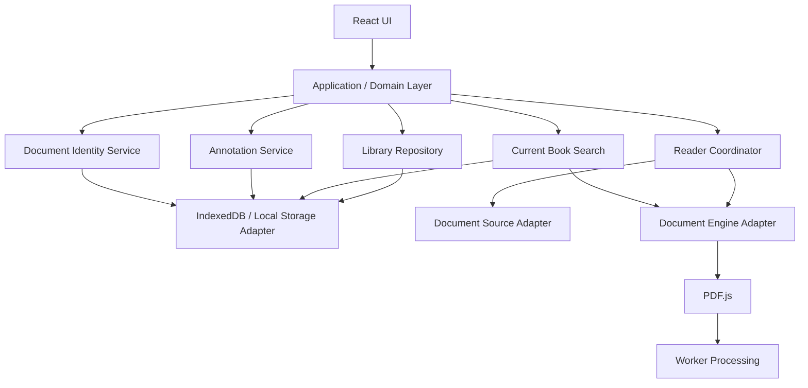
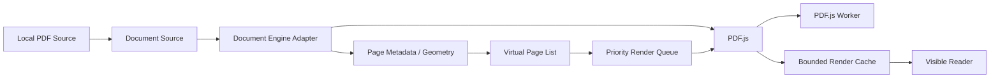
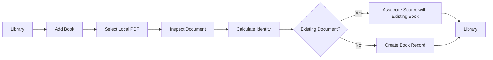

# Phase 1 - Local Reading Foundation

> [!summary]
> **Status:** Planned
> **Product:** [[Product - Overview]]
> **Implementation intent:** This document is the primary implementation brief for an AI coding agent. Read it before implementing Phase 1.

## Goal

Establish the smallest coherent browser-first reading application for local books, beginning with **PDF** as the primary document type. The application must handle unusually large PDFs efficiently, preserve reading state and annotations locally, and establish a clean document abstraction for future formats and eventual native applications.

The primary proof point is a very large document, including approximately 15,000-page PDFs, without making the UI progressively heavier as page count increases.

## Product Principle

> **Build the smallest coherent reading product, not a miniature cloud platform.**

Phase 1 is intentionally local-first. Architecture should have components that justify their existence. Avoid premature backend services, authentication, synchronization infrastructure, AI functionality, or cross-book knowledge features.

---

# 1. Phase Scope

## Included

- Local book import and library.
- Multiple local books.
- PDF as the primary supported document format.
- Optional EPUB support only if it can be added without materially increasing Phase 1 complexity.
- User-controlled local book storage/reference strategy where browser capabilities permit.
- Book metadata and cover/thumbnail where available.
- Continue reading.
- Large-document reading.
- Direct page navigation.
- Table of contents/navigation where the document provides it.
- Local text search within the **current book only**.
- Bookmarks.
- Highlights.
- Notes attached to reading locations.
- Reading progress and last position.
- Local persistence.
- Offline operation.
- Desktop and mobile responsive UX.
- Performance diagnostics/testing for large documents.
- Content-based document identity/fingerprinting for duplicate recognition and future continuity.

## Explicitly Excluded

- Multi-book/global search.
- Backend synchronization.
- Cross-device continuity implementation.
- User accounts/authentication.
- Cloud storage/sync.
- AI reading assistant.
- Cross-book semantic knowledge graph.
- Social/sharing features.
- Advanced analytics.
- OCR/conversion of scanned PDFs in Phase 1.

These belong to later phases and must not leak into Phase 1 architecture.

---

# 2. Recommended Technical Stack

## 2.1 Application Platform

**Recommended:** TypeScript + React + Vite + PWA.

Rationale:

- Excellent fit for a browser-first reading application.
- Mature ecosystem for document viewers and responsive interfaces.
- TypeScript provides strong domain modelling without excessive ceremony.
- Vite keeps local development simple and fast.
- PWA provides installable desktop/mobile behaviour without requiring native applications in Phase 1.

The architecture must remain portable enough that a future native shell/application can reuse the domain, application, persistence abstractions, and document contracts where practical.

Do not introduce Next.js merely for SSR. The reader is fundamentally a client-side application and Phase 1 has no backend requirement.

## 2.2 UI

**Recommended:** React + TypeScript + CSS/Tailwind or a small component system.

Use accessible, reusable primitives for:

- buttons
- dialogs
- drawers
- menus
- toolbars
- tabs
- inputs
- progress indicators
- tooltips
- mobile bottom sheets

Do not build a large design system before the core reading experience works.

## 2.3 Document Engine

**Primary:** Mozilla PDF.js for PDF.

The application must wrap the document engine behind a small internal abstraction such as:

```text
DocumentSource
DocumentIdentity
DocumentMetadata
DocumentPage
DocumentText
DocumentOutline
DocumentRenderer
DocumentSearchProvider
DocumentLocation
```

The abstraction is based on document capabilities, not on PDF-specific concepts. PDF.js is an implementation detail of the PDF adapter.

If EPUB is added later in Phase 1, it must implement the same relevant contracts rather than creating an EPUB-specific reader architecture.

## 2.4 Rendering Strategy

The critical architecture is **virtualized page rendering**.

Never create 15,000 persistent canvas/image DOM nodes for a 15,000-page document.

Use:

- viewport-aware page virtualization
- a small overscan window
- lazy page rendering
- bounded rendered-page cache
- cancellation of pages that leave the priority window
- reuse/release of canvas and bitmap resources
- direct page addressing

The browser should maintain lightweight page placeholders for the document while only a bounded number of actual pages are rendered.

Conceptually:

```text
15,000 logical pages
        |
        v
Page geometry / virtual list
        |
        +---- active viewport
        +---- small overscan window
        |
        v
Priority render queue
        |
        v
PDF.js worker
        |
        v
Bounded render cache
```

## 2.5 User-Controlled Book Storage

A browser application should not silently duplicate every imported book into memory or browser storage.

When importing a book, the user should be able to choose the appropriate persistence approach supported by the browser/platform, such as:

- use the selected local file while it remains accessible, or
- maintain a browser-persistent local copy when the user chooses/when required for durable offline use.

The storage abstraction must hide this choice from the rest of the application.

The application must clearly communicate when a selected file is not durably retained by the browser and therefore may need to be selected again after browser/device storage changes.

Do not load the entire book into application memory merely to provide continuity.

## 2.6 Background Processing

Use **Web Workers** for work that could otherwise block the UI, especially:

- text extraction where practical
- search indexing
- expensive metadata processing
- document preparation

PDF.js itself uses worker-based processing for PDF operations; integrate with that model rather than creating unnecessary worker layers.

The main thread owns UI interaction and viewport coordination. Heavy work must not block scrolling or pointer/touch interaction.

## 2.7 Local Persistence

**Recommended:** IndexedDB behind a repository/storage abstraction.

Persist:

- book metadata
- document identity/fingerprint
- local source metadata
- reading position
- progress
- bookmarks
- highlights
- notes
- search index metadata
- application preferences

Do not store a complete rendered representation of every PDF page in IndexedDB.

Large document/file persistence must be bounded by actual browser storage capabilities. The application should detect storage failures/limits and fail clearly rather than pretending the book is durable.

## 2.8 State Management

**Recommended:** React state for local UI state + Zustand for shared application state.

Keep state boundaries explicit:

```text
UI state
  -> current panels, dialogs, selected result

Reader state
  -> current book, location, zoom, viewport, render status

Library state
  -> books and metadata

Persistent state
  -> IndexedDB-backed repositories
```

Do not put the entire PDF document, every page, large binary data, or rendered page caches into React/Zustand state.

## 2.9 Search

Phase 1 search is deliberately limited to the **currently open book**.

Recommended progression:

1. Extract text per page where text is available.
2. Normalize text.
3. Build a lightweight local page-level index.
4. Persist index metadata locally.
5. Search asynchronously.
6. Return page/location references.
7. Navigate directly to matching pages.

A scanned/image-only PDF does not provide normal text search. The UI must communicate this limitation rather than pretending search is available.

Do not introduce a global search engine or cross-book index in Phase 1.

## 2.10 Testing

Recommended:

- Vitest for unit tests.
- React Testing Library for UI behaviour.
- Playwright for end-to-end tests.
- Performance test harness using representative large PDFs.

The performance suite must include a realistic approximately 15,000-page PDF.

Test at minimum:

- initial open
- direct jump to distant page
- continuous scrolling
- current-book search
- annotation creation
- reopening after restart
- duplicate-document recognition
- memory/resource behaviour
- mobile viewport behaviour
- image-only/scanned PDF detection and warning

## 2.11 Tooling

Recommended baseline:

```text
Node.js
TypeScript
Vite
React
PDF.js
IndexedDB
Zustand
Vitest
React Testing Library
Playwright
ESLint
Prettier
```

Use the current maintained versions at implementation time rather than hard-coding versions in this product document.

---

# 3. Architecture

Phase 1 should remain a single deployable client application.



## Architectural Rules

1. UI does not directly manipulate IndexedDB.
2. UI does not directly depend on PDF.js internals.
3. PDF.js is hidden behind a document-engine adapter.
4. File/reference handling is hidden behind a document-source abstraction.
5. Persistent repositories are isolated from transient UI state.
6. Rendered page resources are owned by the reader/rendering subsystem, not global application state.
7. Search is asynchronous and scoped to the current book.
8. Annotations refer to stable document locations, not DOM elements.
9. Document identity is content-based and independent of the imported filename/path.
10. No backend is required for Phase 1.
11. Components/services must justify their existence; do not create layers merely for ceremony.

---

# 4. Document Identity and Continuity

The application must distinguish **a file instance** from **the logical document represented by its content**.

A user may import the same book again under a different filename or from another location. The application should recognize that it is the same document so reading state and annotations can remain associated with the logical book.

## 4.1 Content Fingerprint

Use a cryptographic content fingerprint, such as SHA-256, as the baseline identity mechanism.

Conceptually:

```text
File bytes
   |
   v
SHA-256 fingerprint
   |
   v
DocumentIdentity
   |
   +---- Book metadata
   +---- ReadingState
   +---- Bookmarks
   +---- Highlights
   +---- Notes
```

The fingerprint must be calculated from document content rather than filename/path.

For very large documents, fingerprint calculation must not require multiple complete copies of the file in memory. Use streaming/chunked processing where the platform permits it.

## 4.2 Duplicate Recognition

When importing a document:

1. Identify the content fingerprint.
2. Check whether the fingerprint already exists.
3. If it exists, associate the new source with the existing logical book rather than creating an unrelated book record.
4. Preserve reading state and annotations.
5. Avoid unnecessary duplicate binary storage where possible.

The exact source/reference model can evolve with browser capabilities, but **logical document identity must remain separate from physical file location**.

## 4.3 Future Continuity

The identity mechanism is intentionally useful for later synchronization, but Phase 1 does not implement synchronization.

A future system can use the same logical document identity to recognize the same book across devices or storage locations.

---

# 5. Large Document Architecture



### Required behaviour

- Page count must not determine the number of rendered DOM nodes.
- Jumping from page 10 to page 12,000 must not require rendering pages 11–11,999.
- The render queue must prioritize visible pages.
- Nearby pages may be prefetched according to a bounded overscan policy.
- Pages leaving the cache window must become eligible for release.
- Rendering must be cancellable where the underlying engine permits it.
- The reader must remain interactive while background rendering occurs.

### Performance philosophy

Phase 1 has explicit target thresholds defined below. These are acceptance targets for representative devices and test documents, not guarantees for every arbitrary PDF/device combination.

The important invariant remains:

> **Resource usage should scale primarily with the active viewport/cache window, not total document page count.**

---

# 6. Image-Based / Scanned PDF Handling

A PDF may contain pages as images rather than machine-readable text.

Phase 1 must support **viewing** these documents, but must clearly distinguish them from text-friendly PDFs.

## 6.1 Detection

During document inspection, determine whether usable text content is available at the document/page level.

## 6.2 Reader Warning

For an image-only or predominantly image-based PDF, display a **red warning banner at the top of the reader** indicating that the document is image-based and not text-friendly.

The warning should communicate the practical limitations, such as:

- normal text search may not work
- text selection/highlighting may be unavailable or limited
- the document is currently being treated primarily as images

The warning must not prevent normal reading.

## 6.3 Future Conversion/OCR

Add a future capability target for converting image-based documents into text-friendly documents, potentially through OCR or another conversion process.

This is **not implemented in Phase 1**.

The document abstraction must not assume that every document has selectable text.

---

# 7. Performance Requirements

These are the initial Phase 1 product targets.

| Operation | Target |
|---|---:|
| Open book | **≤ 1 second** |
| Move to a page already cached | **≤ 3 seconds** |
| Move to a new/uncached section | **≤ 3 seconds** |
| Scrolling | **≥ 9 FPS** |
| Reader memory | **< 500 MB** |
| Current-book search | **≤ 5 seconds** |

These targets should be measured using the Phase 1 performance harness on representative target devices and representative documents.

The test suite should report both successful thresholds and resource trends. A failure should trigger investigation rather than architectural shortcuts such as rendering all pages.

---

# 8. User Experience

## 8.1 Library

Desktop concept:

```text
┌────────────────────────────────────────────────────────────┐
│ My Library                                  + Add Book     │
├────────────────────────────────────────────────────────────┤
│ Continue Reading                                            │
│ ┌────────────────────────────────────────────────────────┐ │
│ │ Book A       42%     Continue →                        │ │
│ └────────────────────────────────────────────────────────┘ │
│                                                            │
│ All Books                                                   │
│ ┌──────────┐ ┌──────────┐ ┌──────────┐ ┌──────────┐       │
│ │  Cover   │ │  Cover   │ │  Cover   │ │  Cover   │       │
│ │ Book A   │ │ Book B   │ │ Book C   │ │ Book D   │       │
│ │ 42%      │ │ 12%      │ │ New      │ │ 81%      │       │
│ └──────────┘ └──────────┘ └──────────┘ └──────────┘       │
└────────────────────────────────────────────────────────────┘
```

Important UX:

- Continue Reading should be the fastest path back into a book.
- Recently opened books should be easy to find.
- Progress should be visible but not visually dominant.
- Import should be obvious.
- The library should remain usable offline.
- Duplicate imports of the same content should resolve to the same logical book.

## 8.2 Reader - Desktop

```text
┌──────────────────────────────────────────────────────────────┐
│ ← Library   Book Title        421 / 15,000   🔍 🔖 ⋮        │
├────────────┬─────────────────────────────────────┬───────────┤
│ Contents   │                                     │ Context   │
│            │                                     │           │
│ Chapter 1  │                                     │ Search    │
│ Chapter 2  │             PDF PAGE                │ Bookmarks │
│ Chapter 3  │                                     │ Notes     │
│            │                                     │           │
│ Bookmarks  │                                     │           │
│ • Page 82  │                                     │           │
│ • Page 421 │                                     │           │
└────────────┴─────────────────────────────────────┴───────────┘
```

For image-based PDFs, a red warning banner appears above the reading area.

Suggested desktop behaviour:

- Left navigation is collapsible.
- Right contextual panel is collapsible.
- Center reading area gets the majority of screen space.
- Page number control supports direct navigation.
- Current-book search can open as a side panel rather than replacing the reader.
- Keyboard shortcuts may be added where natural.

## 8.3 Reader - Mobile

```text
┌─────────────────────────────┐
│ ← 421 / 15,000          ⋮  │
├─────────────────────────────┤
│   IMAGE PDF WARNING (if any)│
├─────────────────────────────┤
│                             │
│          PDF PAGE           │
│                             │
├─────────────────────────────┤
│       Reading progress      │
├─────────────────────────────┤
│ 🔖   ✨   Aa   ☰   🔍      │
└─────────────────────────────┘
```

Mobile principles:

- Reader content takes priority.
- Navigation and annotation tools should use bottom sheets/toolbars.
- Avoid permanent sidebars.
- Touch targets must be comfortable.
- Resource/cache limits can be more conservative than desktop.

---

# 9. Core User Flows

## Add Book



## Open Book


## Current-Book Search


## Annotation


---

# 10. Annotation UX

Annotations should feel like a reading tool, not a separate document-management system.

### Bookmark

One action from the reader. A bookmark represents a stable reading location.

### Highlight

Where the document engine exposes selectable text, select text and create a highlight. The annotation model must not assume that all document types support text selection.

### Note

A note is attached to a stable document location and can contain user-entered text.

### Annotation list

The reader should provide a way to see annotations for the current book and jump back to their locations.

Do not build cross-book annotation management in Phase 1.

---

# 11. Document Location Abstraction

A document location is a logical location understood by the relevant document type.

It must be stable enough to reconstruct an annotation after reopening the document and must not depend on temporary DOM identifiers.

Examples of implementation-specific representations may include:

```text
PDF
  -> page index + normalized coordinates / text selection data

EPUB (future/optional)
  -> document/chapter identifier + text position/CFI-like location
```

The application should expose a common `DocumentLocation` contract while allowing each document adapter to define its internal representation.

Annotations should therefore depend on:

```text
BookId + DocumentLocation
```

rather than:

```text
DOM element id
```

---

# 12. Reading State

Reading state must be persisted frequently enough that closing/reloading the application does not lose meaningful progress, while avoiding a write on every scroll event.

Recommended approach:

- maintain transient position in memory
- debounce persistence
- persist on meaningful location changes
- persist on visibility/page lifecycle events
- persist before closing where possible

Persist at least:

- logical document identity
- current document location
- progress
- reader settings required for continuity
- last opened timestamp

When the same document is imported again, the existing reading state must be reused.

---

# 13. Offline Model

Phase 1 should behave as an offline application.

```text
Local Source
   ↓
Document Identity
   ↓
Local Library
   ↓
Local Reader
   ↓
Current-Book Search
   ↓
Local Annotations
   ↓
Local Reading State
```

No request to a remote backend should be necessary for the core reading workflow.

If browser storage persistence is unavailable or constrained, fail clearly rather than silently pretending the book/state is durable.

---

# 14. Suggested Project Structure

```text
src/
├── app/
│   ├── routes/
│   ├── providers/
│   └── app-shell/
├── domain/
│   ├── book/
│   ├── document/
│   ├── reading/
│   ├── annotation/
│   └── search/
├── application/
│   ├── library/
│   ├── reader/
│   ├── search/
│   ├── annotations/
│   └── document-identity/
├── infrastructure/
│   ├── persistence/
│   ├── document-source/
│   ├── document-engine/
│   │   └── pdfjs/
│   └── search-index/
├── features/
│   ├── library/
│   ├── reader/
│   ├── search/
│   └── annotations/
├── components/
├── workers/
└── tests/
```

This is a logical boundary, not a mandate to create dozens of projects/packages.

---

# 15. AI Coding Agent Instructions

When an AI coding agent receives this Phase 1 document:

1. Treat this document as the Phase 1 implementation contract.
2. Read the linked product/capability/specification documents before making architectural changes.
3. Do not expand Phase 1 into synchronization, accounts, AI, cloud storage, global search, or cross-book knowledge features.
4. Prefer the smallest architecture that satisfies the requirements.
5. Do not replace virtualization with a simpler all-pages rendering approach.
6. Do not store large binary/rendered page collections in React state.
7. Keep document-engine details behind an adapter.
8. Keep document source/file handling behind an adapter.
9. Treat document identity as content-based, not filename/path-based.
10. Reuse logical book state when the same document fingerprint is imported again.
11. Keep current-book search asynchronous and local.
12. Support image-only PDFs for viewing and show the required red warning; do not pretend they are text-friendly.
13. Do not implement OCR/conversion merely because the future seam exists.
14. Write tests for behaviour before declaring a capability complete.
15. Use the 15,000-page stress document in performance testing.
16. Verify the explicit performance targets during implementation.
17. If a requirement is ambiguous, preserve the Phase 1 product principles and record the decision rather than silently expanding scope.
18. New components/services/dependencies must justify their existence.
19. Do not introduce a dependency merely because it is popular; explain the problem it solves.
20. Do not optimize prematurely, but do not compromise the large-document architecture for implementation convenience.
21. Keep browser-specific concerns behind abstractions where they would otherwise make eventual native applications unnecessarily difficult.

---

# 16. Phase 1 Acceptance Criteria

Phase 1 is complete when all of the following are demonstrated:

- Multiple local books can be maintained in the library.
- PDF is fully supported for the primary reading workflow.
- EPUB is supported only if its addition does not materially complicate the Phase 1 architecture.
- A representative 15,000-page PDF can be opened and read without attempting to render all pages simultaneously.
- The user can navigate directly to distant pages without rendering intervening pages.
- Scrolling remains usable while the document is being processed/rendered.
- Rendered page resources remain bounded and can be released outside the active/cache window.
- The reader is usable on representative mobile and desktop devices.
- Search works locally within the current book when usable text is available.
- Search results can navigate directly to matching locations.
- Image-only/scanned PDFs can be viewed and receive the required red image-PDF warning.
- The user can create and revisit bookmarks, highlights, and notes where the document type supports the relevant capability.
- Reading location and progress survive application/browser restart when the source/storage strategy supports persistence.
- Re-importing the same document content is recognized using the content fingerprint and reuses the logical book/reading state.
- Library and reading state remain usable without a network connection.
- No backend service is required for the above behaviour.
- Initial performance targets are measured and reported:
  - open ≤ 1 second
  - cached-page movement ≤ 3 seconds
  - new-section movement ≤ 3 seconds
  - scrolling ≥ 9 FPS
  - reader memory < 500 MB
  - current-book search ≤ 5 seconds

---

# 17. Future Compatibility Without Future Implementation

Phase 1 should leave clean seams for later phases without implementing them.

Future synchronization should be able to operate on logical entities such as:

```text
DocumentIdentity
Book metadata
ReadingState
Bookmark
Highlight
Note
```

The content fingerprint provides a stable mechanism for recognizing the same document content independently of its physical file location.

Future native applications should be able to reuse the product's domain/application concepts while replacing browser-specific infrastructure such as file access, persistence, rendering host, and platform integration.

Future OCR/conversion should be able to take an image-based document and produce a text-friendly representation without changing the core reader contract.

Phase 1 must not implement these future capabilities merely to prepare for them.
